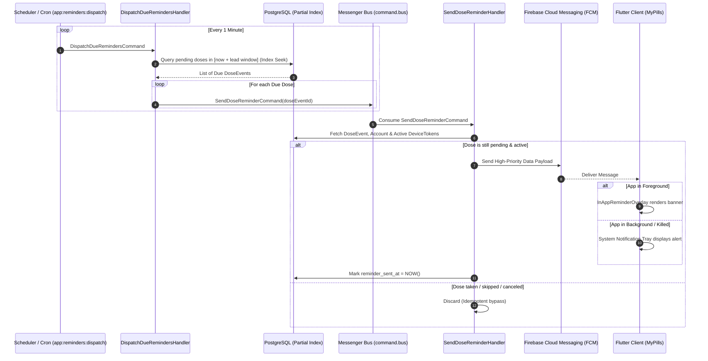

# Server-Driven Notifications & Alerts Architecture

This document describes the design and implementation of the **100% Server-Driven Notification Engine** for MyPills. It establishes a resilient, scalable, and Clean Architecture (DDD + CQRS) approach for delivering both system push notifications and real-time in-app alerts.

---

## 1. Executive Summary & Goals

* **Single Source of Truth:** The server orchestrates when reminders are triggered based on expanded `DoseEvent` schedules and user preferences.
* **Unified Delivery (FCM Data Payloads):** A single high-priority push message serves both OS system notifications (background/closed) and in-app modal banners (foreground).
* **High-Performance & Scalability:** Uses PostgreSQL **Partial Indexes** to achieve sub-5ms index seeks during minute-by-minute dispatching, avoiding full table scans over millions of historical dose rows.
* **Strict Hexagonal / DDD Compliance:** Zero coupling between Domain, Doctrine, and Symfony framework components.

---

## 2. High-Level Flow



---

## 3. Database & Indexing Strategy (PostgreSQL)

### 3.1 Schema Enhancement on `dose_events`

To track notification delivery and support partial indexing, `dose_events` includes:

* `reminder_sent_at` (`TIMESTAMP WITH TIME ZONE NULL`): Timestamp when the reminder was successfully dispatched.
* `status` (`VARCHAR(32)`): Current status (`pending`, `taken`, `missed`, `skipped`).

### 3.2 The Partial Index

```sql
-- PostgreSQL Partial B-Tree Index
CREATE INDEX idx_pending_dose_reminders 
ON dose_events (scheduled_at) 
WHERE status = 'pending' AND reminder_sent_at IS NULL;
```

#### Why it scales:
1. **O(log K) complexity:** Where $K$ is only the number of *active pending* doses (typically a few thousand across all active users), ignoring tens of millions of historical rows.
2. **Sub-5ms Execution:** The query planner performs a direct *Index Range Scan* matching the target time bucket (`[now, now + interval]`).
3. **Low Write Overhead:** Once `reminder_sent_at` is populated, the row is automatically evicted from the partial index, keeping the index tree compact in RAM.

---

## 4. Domain-Driven Design & Context Mapping

Following `AGENTS.md` bounded context rules:

### 4.1 Bounded Contexts Involved

| Context | Responsibility |
|---|---|
| `DoseEvent` | Owns `DoseEvent` lifecycle, scheduling, status updates (`taken`, `missed`). |
| `Notification` | Owns `DeviceToken`, `NotificationPreferences`, dispatch handlers, and `PushNotificationGateway`. |
| `Identity` | Owns user account and device ownership. |

### 4.2 Folder & Class Structure

```
src/
  Notification/
    Domain/
      DeviceToken.php
      NotificationPreferences.php
      PushNotificationGateway.php
      ReminderDispatchPolicy.php
      ValueObject/
        ReminderChannel.php
        ReminderStatus.php
    Application/
      Command/
        DispatchDueRemindersCommand.php
        DispatchDueRemindersHandler.php
        SendDoseReminderCommand.php
        SendDoseReminderHandler.php
    Infrastructure/
      Persistence/
        DoctrineDeviceTokenRepository.php
        DoctrineNotificationPreferencesRepository.php
      FcmPushNotificationGateway.php
    UI/
      Cli/
        DispatchRemindersCommand.php
```

---

## 5. Message Payloads & Client Coordination

### 5.1 FCM Data Payload Specification

The backend sends a **High-Priority Data Message** (with optional notification block for native OS fallback):

```json
{
  "message": {
    "token": "fcm_device_token_xyz",
    "android": {
      "priority": "HIGH"
    },
    "apns": {
      "headers": {
        "apns-priority": "10"
      },
      "payload": {
        "aps": {
          "content-available": 1,
          "sound": "default"
        }
      }
    },
    "data": {
      "type": "dose_reminder",
      "doseEventId": "01912a7e-1234-7000-8000-000000000001",
      "medicationName": "Amoxicilina",
      "doseDisplay": "500 mg",
      "doseAmount": "500",
      "doseUnit": "mg",
      "scheduledAt": "2026-08-17T14:00:00Z",
      "anticipationMinutes": "0"
    }
  }
}
```

### 5.2 Flutter Client Consumption

1. **Foreground (`FirebaseMessaging.onMessage`):**
   * Detects `message.data['type'] == 'dose_reminder'`.
   * If `prefs.inAppBannersEnabled == true`, passes the payload to `InAppReminderOverlay` to animate the top banner.
   * If `prefs.pushNotificationsEnabled == true` and the app is active, it suppresses the duplicate system tray notification.
2. **Background / Terminated (`FirebaseMessaging.onBackgroundMessage`):**
   * The OS notification tray displays the reminder.
   * Clicking the notification opens the app and navigates to `/today` or the specific dose tracker view.

---

## 6. Concurrency, Race Conditions & Idempotency

1. **Early Dose Intake:** If a user marks a dose as `taken` 10 minutes before the scheduled time, `status` changes to `taken`. When `SendDoseReminderHandler` runs, it verifies `dose.status === pending` and safely aborts.
2. **Duplicate Dispatch Prevention:**
   * When fetching candidate doses in `DispatchDueRemindersHandler`, rows are locked or immediately updated with a transient state/timestamp to prevent concurrent worker overlaps.
3. **Timezone Uniformity:** All comparisons and scheduling calculations in the backend are strictly performed in **UTC (`DateTimeImmutable('now', new \DateTimeZone('UTC'))`)**.

---

## 7. Migration & Future Scalability Path

* **Phase 1 (Current):** PostgreSQL Partial Index + Symfony Messenger Queue.
* **Phase 2 (Ultra-Scale / Millions of concurrent users):** Swap `ReminderDispatchPolicy` repository implementation with **Redis Sorted Sets (ZSET Time-Wheel)** without modifying domain entities or application use cases.
